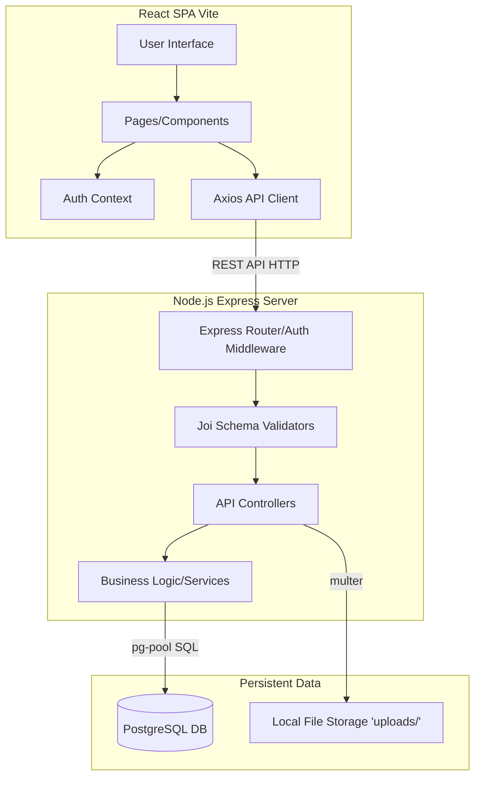

# R&R Cafeteria — Canteen Management System

Full-stack web application for canteen operations with role-based workflows for customers and admins.

## Current Implementation Summary

### Customer Features
- Menu browsing with search and category filtering
- Cart and checkout (wallet and cash payment options)
- Order tracking and transaction history
- Wallet (balance, top-up via GCash/Maya/Bank Transfer with security PIN)
- Profile and account settings (name, phone, email, password, wallet PIN, profile picture)
- Account deletion (soft delete — anonymizes personal data, preserves order history)
- Modern UI with dark mode / light mode toggle

### Admin Features
- **Comprehensive Dashboard:** Interactive metrics cards, 6-stage order pipeline, recent orders feed, and real-time low-stock alerts side panel
- **Menu Management:** Category tabs and category/item CRUD (with image upload)
- **Order Management:** Status controls (Pending → Paid → Preparing → Ready → Completed) and date-range filters
- **Inventory Management:** Stock-in/stock-out capabilities with low-stock visual flags
- **Wallet Control:** Cash-based customer wallet top-up at counter (`/admin/topup`) with transaction history
- **Analytics & Reports Suite:** 7 dedicated report categories (Sales, Inventory, Transactions, Menu Performance, Customers, Order Analytics, Cash Collection)
- **Export Capabilities:** Comprehensive PDF printing and CSV export for all report types
- **Settings:** Admin account creation and management (original admin is protected as OWNER)

## Project Documentation & Guides

- **API Reference:** `API_DOCUMENTATION.md`
- **Diagrams Guide:** `Lucidchart_Guide_RR_Canteen.md` (Detailed step-by-step for creating Flowchart and DFD Level 1)

## Technology Stack

| Layer | Technology |
|---|---|
| Frontend | React 18, Vite 5, Tailwind CSS 3, Lucide React, Recharts |
| Backend | Node.js, Express 4, Joi validation, JWT auth, Multer, Helmet, Morgan |
| Database | PostgreSQL 16 |
| DevOps | Docker Compose |

## System Architecture

Frontend (React SPA) calls REST APIs in backend (Express), and backend reads/writes PostgreSQL.



## Quick Start (Local Development)

### Prerequisites
- Node.js 18+
- Docker Desktop

### Recommended Approach (One Command)

```bash
npm start
```
This script handles everything: starts the database via Docker, runs backend migrations/seeds, and launches both frontend and backend dev servers.

### Manual Setup
```bash
# From project root
docker compose -f docker/docker-compose.yml up -d

cd backend
npm install
node src/database/migrate.js
node src/database/seed.js

cd ../frontend
npm install
```

Run services manually:
```bash
# terminal 1
cd backend && npm run dev

# terminal 2
cd frontend && npm run dev
```

## Default URLs & Test Accounts

- Frontend: `http://localhost:3000`
- Backend: `http://localhost:5000`

| Role | Email | Password |
|---|---|---|
| Admin | admin@canteen.local | admin123 |
| Customer | user1@example.com | user123 |

## Core API Routing

- `/api/auth` — Registration, login, profile
- `/api/menu` — Menu items and categories
- `/api/orders` — Customer orders + admin status management
- `/api/payments` — Payment processing, wallet top-up, balance, PIN
- `/api/inventory` — Stock-in/stock-out, low-stock alerts
- `/api/admin/wallet` — Admin counter top-up for customers
- `/api/settings` — Profile, security, admin account management
- `/api/reports` — Advanced analytics and data export
