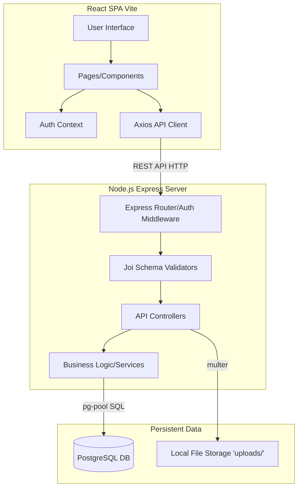

# Canteen Management System

Full-stack web application for canteen operations with role-based workflows for customers, admins, and staff.

## Current Implementation Summary

### Customer Features
- Menu browsing with search and category filtering
- Cart and checkout (wallet and cash)
- Order tracking and transaction history
- Wallet view (balance + history)
- Profile and account settings (name, phone, email, password, wallet PIN, profile picture)

### Admin/Staff Features
- Dashboard with key operational metrics
- Menu management with category tabs and category CRUD
- Order management with status controls and date-range filters
- Inventory stock-in/stock-out with low-stock visibility
- Cash-based customer wallet top-up at counter (`/admin/topup`)
- Top-up history and cash collection visibility
- Comprehensive reports suite (7 report categories)
- Admin account management from settings (admin role)

## Technology Stack

| Layer | Technology |
|---|---|
| Frontend | React 18, Vite, Tailwind CSS |
| Backend | Node.js, Express, Joi validation, JWT auth, Multer |
| Database | PostgreSQL |
| DevOps | Docker Compose |

## System Architecture

Frontend (React SPA) calls REST APIs in backend (Express), and backend reads/writes PostgreSQL.



- Frontend: `frontend/src`
- Backend API: `backend/src`
- DB setup: `docker/init.sql`, `backend/src/database/migrations`
- Uploads: `backend/uploads`

## Quick Start

### Prerequisites
- Node.js 18+
- Docker Desktop

### Recommended (one command)

```bash
npm start
```

This starts database, backend, and frontend.

### Manual setup

```bash
# From project root
docker compose -f docker/docker-compose.yml up -d

cd backend
npm install
node src/database/migrate.js
node src/database/seed.js

cd ../frontend
npm install
```

Run services:

```bash
# backend
cd backend
npm run dev

# frontend (separate terminal)
cd frontend
npm run dev
```

## Default URLs

- Frontend: `http://localhost:3000`
- Backend: `http://localhost:5000`
- Health: `http://localhost:5000/health`

## Test Accounts

| Role | Email | Password |
|---|---|---|
| Admin | admin@canteen.local | admin123 |
| Customer | user1@example.com | user123 |

## Core API Groups

- `/api/auth`
- `/api/menu`
- `/api/orders`
- `/api/payments`
- `/api/inventory`
- `/api/admin/wallet`
- `/api/settings`
- `/api/reports`

See full endpoint details in `API_DOCUMENTATION.md`.

## Project Docs

- Implementation plan: `CURRENT_IMPLEMENTATION_PLAN.md`
- Progress log: `PROGRESS.md`
- API reference: `API_DOCUMENTATION.md`
- User guide: `docs/USER_GUIDE.md`
