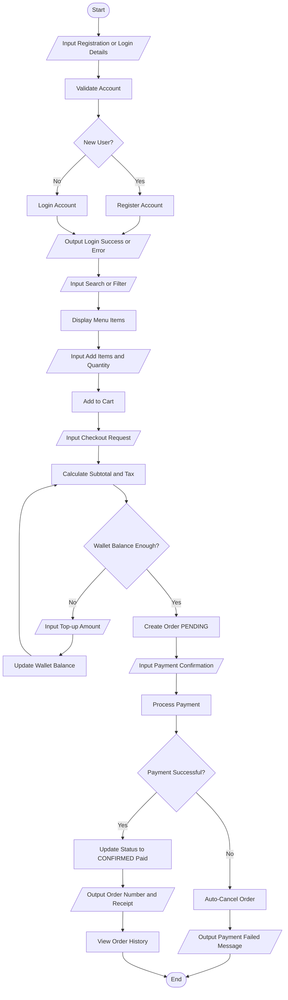
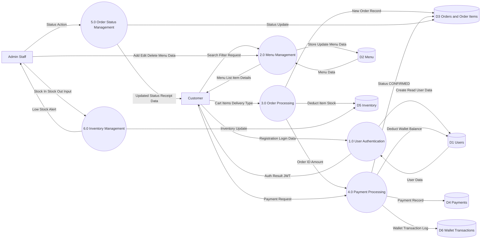

# Canteen Management - Example Charts

Use these as visual references while building in Lucidchart.

## 1) Example Flowchart (with Input/Output)

## 2) Example DFD Level 1

## 3) Lucidchart Build Tip

When reproducing these in Lucidchart:
- Flowchart symbols:
  - Oval = Start End
  - Rectangle = Process
  - Diamond = Decision
  - Parallelogram = Input Output
- DFD symbols:
  - Rectangle = External Entity
  - Circle = Process
  - Open rectangle = Data Store
  - Arrow label = Data Flow
